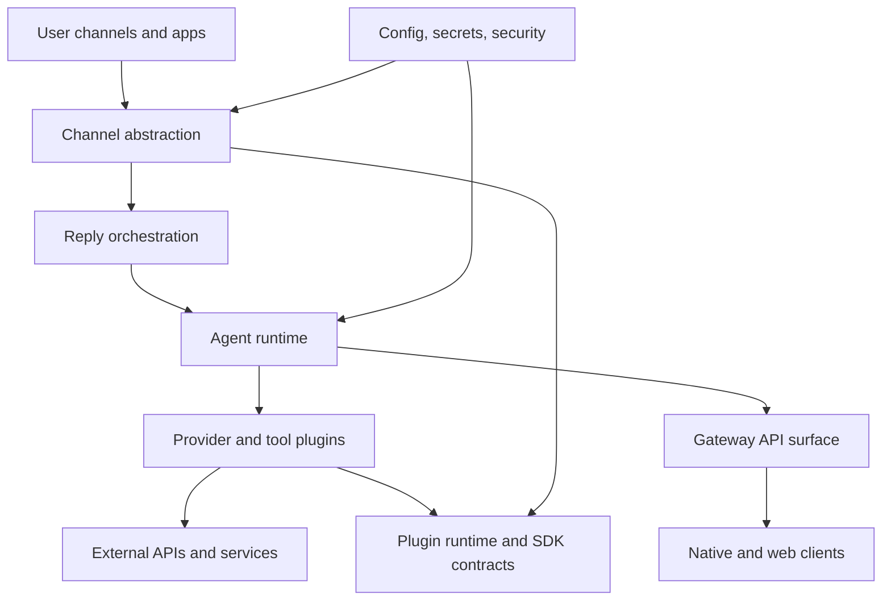
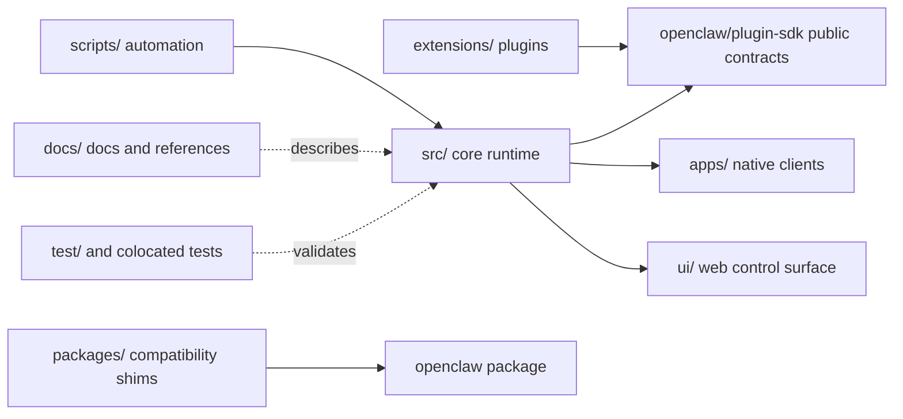
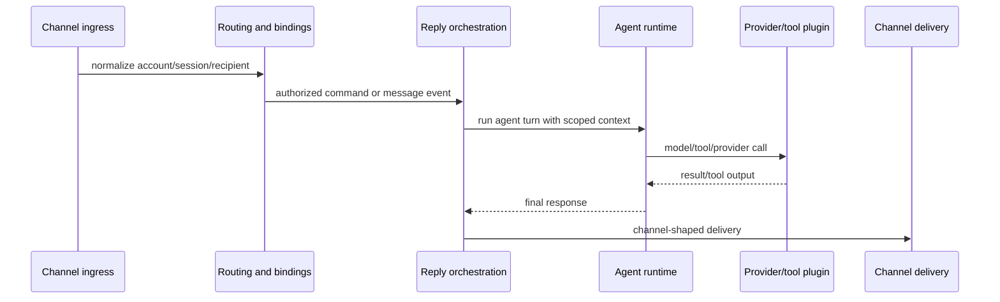

# OpenClaw Architecture Atlas

Coverage: `exceptioned-deep-partial`

> Target baseline: this atlas is carried forward for `v2026.5.4` sidegrade recovery. Version-diff facts live in `.planning/version-diff/v2026.4.24...v2026.5.4/`; stale deleted-source references are archived under that transition directory.

This atlas captures the current architecture without moving or changing source code. It is a read-only interpretation layer over the existing repository layout, GitNexus index, import-boundary evidence, observed runtime flows, and the imported architecture blueprint content.

## Brownfield normalization diagrams







## Scope and evidence

Evidence used for this snapshot:

- Repository-local directory inspection of `src/`, `extensions/`, `apps/`, `ui/`, `packages/`, `docs/`, and `scripts/`.
- GitNexus current-worktree index for `openclaw` at commit `ab54c93` with `139497` symbols, `198754` relationships, `3185` clusters, and `300` execution flows.
- code-review-graph current-worktree build on branch `VersionAnalyze` at commit `ab54c932d998` with `8581` files, `80939` nodes, and `732238` edges.
- The earlier imported GitNexus/code-review evidence from `openclaw-v2026.3.24` remains historical context, but current handoff readiness uses the `VersionAnalyze` tool status recorded under `.planning/impact-map/evidence/brownfield-normalization-2026-05-09/`.
- Existing impact-map scaffolding under `.planning/impact-map/`.
- Existing repository guardrails for plugin import boundaries, docs conventions, build/test commands, and module ownership.

This document is intentionally descriptive. It does not require source-code migration.

## Architecture judgment

OpenClaw is best understood as a plugin-based, multi-channel, cross-platform agent runtime system.

It is not a strict tree-shaped monolith. The maintainable model is a layered DAG:

```text
Apps / UI / CLI / Channels
-> Gateway / Control Plane
-> Auto Reply Orchestration
-> Agent Runtime
-> Tools / Providers / Memory / Browser / Media
-> Outbound Delivery
-> Channel / Plugin Response
```

The architecture should therefore be read through four views together:

```text
Ownership Tree + Dependency DAG + Runtime Flow + Hotspot Map
```

## How to read the architecture

Use four complementary views:

1. **Ownership tree**: where files live and which team/module owns them.
2. **Logical module map**: what capability each area provides.
3. **Dependency DAG**: which modules are allowed to depend on which other modules.
4. **Runtime flows and hotspots**: how real requests move through the system and where changes have high blast radius.

Do not treat GitNexus community labels as the canonical module tree. The labels are useful for coupling analysis, but repeated labels such as `Agents`, `Infra`, `Gateway`, and `Plugins` indicate multiple related communities rather than one clean hierarchy.

## Top-level ownership tree

```text
OpenClaw
├─ Core runtime: src/
├─ Plugins: extensions/
├─ Native apps: apps/
├─ Web/control UI: ui/
├─ Shared packages: packages/
├─ Documentation: docs/
├─ Automation and release tooling: scripts/
└─ Tests and fixtures: test/ plus colocated *.test.ts files
```

Top-level responsibilities:

| Path          | Large module        | Primary purpose                                                                     | Architecture role                                 |
| ------------- | ------------------- | ----------------------------------------------------------------------------------- | ------------------------------------------------- |
| `src/`        | Core runtime        | CLI, gateway, agent runtime, channels, plugin runtime, config, infra, media, memory | Product/runtime kernel                            |
| `extensions/` | Plugins             | Channel, provider, tool, media, memory, and integration plugins                     | Extension surface through `openclaw/plugin-sdk/*` |
| `apps/`       | Native apps         | macOS, iOS, Android app surfaces and platform config                                | User-facing clients                               |
| `ui/`         | Web/control UI      | Browser-based control UI                                                            | User-facing web surface                           |
| `packages/`   | Compatibility shims | Legacy compatibility packages that forward to `openclaw`                            | Package-name compatibility                        |
| `docs/`       | Documentation       | Mintlify docs, help, install, release references                                    | User and maintainer knowledge                     |
| `scripts/`    | Tooling             | Build, release, package, lint, docs, and maintenance scripts                        | Automation and CI support                         |
| `test/`       | Cross-cutting tests | Integration helpers, fixtures, and broad test setup                                 | Validation support                                |

## Logical module map

```text
OpenClaw
├─ Core Runtime
│  ├─ Agent Runtime
│  ├─ Reply Orchestration
│  ├─ Gateway / API Surface
│  ├─ Channel Abstraction
│  ├─ Plugin Runtime / Plugin SDK
│  ├─ Infra / Outbound Delivery
│  ├─ Config / Secrets / Security
│  └─ Capability Modules
├─ Plugins
│  ├─ Channel Plugins
│  ├─ Model / Provider Plugins
│  ├─ Tool / Capability Plugins
│  ├─ Memory / Media Plugins
│  └─ Auth / Integration Plugins
├─ Apps / UI
│  ├─ macOS
│  ├─ iOS
│  ├─ Android
│  ├─ Shared App Code
│  └─ Web / Control UI
├─ Docs
└─ Tooling / Scripts / Compatibility Packages
```

## Core runtime module tree

This tree groups the physical `src/` directories by the logical Core Runtime modules above. It is a read-only ownership view, not a request to move source files.

GitNexus/code-review-graph split refinement: the impact map keeps this top-level ownership view, but high-risk `src` aggregates are further split under `agent-runtime/runtime/`, `capability-modules/acp/`, `config-secrets-security/secrets-resolution/`, `reply-orchestration/commands/`, and `cli-commands/command-implementations/`. Root-level support files are explicitly covered by `shared-misc-runtime-support/root-entrypoints/` and `shared-misc-runtime-support/web-provider-root/`.

```text
src/
├─ Agent Runtime
│  └─ agents/              # agent execution, providers, tools, sandbox, Pi runner, auth profiles
├─ Reply Orchestration
│  └─ auto-reply/          # message-to-agent orchestration and reply pipeline
├─ Gateway / API Surface
│  └─ gateway/             # gateway server, protocol, HTTP/server methods, client interactions
├─ Channel Abstraction
│  ├─ channels/            # channel abstraction, binding helpers, plugin channel support
│  ├─ bindings/            # binding provider records and compiled channel bindings
│  └─ routing/             # recipient/account/session route resolution
├─ Plugin Runtime / Plugin SDK
│  ├─ plugins/             # plugin runtime, contracts, loading, boundary enforcement
│  └─ plugin-sdk/          # public SDK surface consumed by extensions
├─ Infra / Outbound Delivery
│  └─ infra/               # outbound delivery, network, TLS, common infrastructure helpers
├─ Config / Secrets / Security
│  ├─ config/              # config IO, schema/validation, sessions, legacy migration
│  ├─ secrets/             # secret storage and resolution
│  ├─ security/            # audit, filesystem/path guards, remediation helpers
│  └─ sessions/            # session path and runtime state helpers
├─ Capability Modules
│  ├─ acp/                 # ACP client/server/control-plane/runtime support
│  ├─ browser/             # browser bridge, profile/session routes, actions, snapshots, debug/storage
│  ├─ context-engine/      # context engine registry, types, initialization, legacy support
│  ├─ cron/                # scheduled and isolated agent jobs
│  ├─ media/               # media server and processing pipeline
│  ├─ media-understanding/ # media understanding capability support
│  ├─ memory/              # memory/session files/vector integration and managers
│  └─ tts/                 # text-to-speech runtime support
├─ CLI / Commands
│  ├─ cli/                 # CLI command registration, CLI runtime wiring, command groups
│  ├─ commands/            # command implementations and command-specific helpers
│  ├─ terminal/            # ANSI-safe terminal output helpers and palette
│  └─ tui/                 # terminal UI views/components
└─ Shared / Misc Runtime Support
   ├─ daemon/              # daemon/launch/runtime helpers
   ├─ hooks/               # hook discovery and workspace integration
   ├─ process/             # process/supervisor helpers
   ├─ shared/              # shared primitives
   ├─ utils/               # utility helpers
   └─ types/               # shared types and compatibility helpers
```

### Detailed core runtime boundaries

| Logical submodule            | Main paths                                                                                                                                                                                        | Responsibility                                                                                  | Planning granularity                                                                              |
| ---------------------------- | ------------------------------------------------------------------------------------------------------------------------------------------------------------------------------------------------- | ----------------------------------------------------------------------------------------------- | ------------------------------------------------------------------------------------------------- |
| Agent execution core         | `src/agents/*.ts`                                                                                                                                                                                 | Agent command handling, scope, spawning, provider wiring, tool orchestration                    | Runner/tool/provider file groups with colocated tests                                             |
| Agent tools                  | `src/agents/tools/`, `src/agents/*tools*`                                                                                                                                                         | Bash, apply-patch, browser/tool adapters, tool schemas                                          | One tool family per leaf                                                                          |
| Sandbox and auth profiles    | `src/agents/sandbox/`, `src/agents/auth-profiles/`                                                                                                                                                | Sandboxed execution plus provider auth profile selection                                        | Sandbox runner and profile resolver leaves                                                        |
| Pi embedded runner           | `src/agents/pi-embedded-runner/`, `src/agents/pi-embedded-helpers/`, `src/agents/pi-extensions/`                                                                                                  | Pi/local embedded agent runtime, compaction, extensions, provider support                       | Runner, helper, extension, and provider-specific slices                                           |
| Skills and schemas           | `src/agents/skills/`, `src/agents/schema/`                                                                                                                                                        | Skill discovery/refresh and tool schema contracts                                               | Loader/refresh group and schema contract group                                                    |
| Reply orchestration runner   | `src/auto-reply/reply/agent-runner*.ts`, `src/auto-reply/reply/commands-*.ts`, `src/auto-reply/reply/commands-acp/`, `src/auto-reply/reply/commands-subagents/`, `src/auto-reply/reply/channel-*` | Message-to-agent runner, command handling, streaming, channel shaping                           | Runner, commands, streaming, queue, export, exec, and channel-shaping leaves                      |
| Gateway server and protocol  | `src/gateway/server/`, `src/gateway/protocol/`, `src/gateway/*.ts`                                                                                                                                | Gateway lifecycle, auth, protocol contracts, server startup, connection handling                | Server lifecycle and protocol groups                                                              |
| Gateway server methods       | `src/gateway/server-methods/`                                                                                                                                                                     | API method handlers for agents, chat, config, nodes, browser, devices, skills, and system       | One handler domain per API leaf; check API impact before behavior or response-shape changes       |
| Channel plugin bridge        | `src/channels/plugins/`, `src/channels/allowlists/`, `src/channels/transport/`, `src/channels/web/`                                                                                               | Core channel abstractions, plugin channel binding, allowlists, transport helpers                | Binding, actions, contracts, outbound, status, allowlist, and transport leaves                    |
| Plugin runtime and contracts | `src/plugin-sdk/`, `src/plugins/runtime/`, `src/plugins/contracts/`, `src/plugins/test-helpers/`                                                                                                  | Public SDK subpaths, plugin loading, runtime adapters, metadata/contracts, test support         | One public SDK subpath or runtime adapter group per leaf                                          |
| Outbound delivery            | `src/infra/outbound/`, `src/channels/plugins/outbound/`                                                                                                                                           | Delivery queue, routing, channel selection, send service, message actions                       | Delivery, routing, actions, identity, formatting, and plugin-outbound bridge leaves               |
| Config, secrets, security    | `src/config/`, `src/config/sessions/`, `src/secrets/`, `src/security/`, `src/sessions/`                                                                                                           | Config IO, schema, sessions, credential resolution, path/security guards, runtime state helpers | Keep as lower-level support; avoid reverse dependencies on gateway, agents, or auto-reply details |
| Capability modules           | `src/browser/`, `src/memory/`, `src/media/`, `src/media-understanding/`, `src/context-engine/`, `src/tts/`, `src/cron/`, `src/acp/`                                                               | Browser bridge, memory, media, context assembly, TTS, scheduled jobs, ACP integration           | Split by capability entrypoint, protocol, manager, route, or persistent binding                   |

## Plugin module tree

```text
extensions/
├─ Channel plugins
│  ├─ discord
│  ├─ telegram
│  ├─ slack
│  ├─ matrix
│  ├─ whatsapp
│  ├─ msteams
│  ├─ line
│  ├─ signal
│  ├─ imessage
│  └─ other chat/channel integrations
├─ Model / provider plugins
│  ├─ openai
│  ├─ anthropic
│  ├─ xai
│  ├─ minimax
│  ├─ google
│  ├─ deepseek
│  ├─ ollama
│  └─ other model/provider packages
├─ Tool / capability plugins
│  ├─ tavily
│  ├─ firecrawl
│  ├─ exa
│  ├─ brave
│  ├─ duckduckgo
│  └─ browser/search/task helpers
├─ Memory / media / voice plugins
│  ├─ memory-core
│  ├─ memory-lancedb
│  ├─ voice-call
│  ├─ elevenlabs
│  └─ deepgram
└─ Auth / integration plugins
   ├─ qwen-portal-auth
   ├─ github-copilot
   ├─ cloudflare-ai-gateway
   └─ vendor-specific integrations
```

Plugin architecture rule:

```text
extensions/*
  -> openclaw/plugin-sdk/*
  -> local files inside the same extension package
```

Forbidden production-code directions:

```text
extensions/<id> -> src/** direct relative import
extensions/<id> -> another extension's src/**
extensions/<id>/dependencies -> workspace:* runtime deps
```

Avoid treating `extensions/*` as core internals. Extensions are packages, even when bundled in this repository.

## Apps and UI module tree

```text
apps/
├─ macos/       # macOS menubar app, gateway control surface, platform integration
├─ ios/         # iOS app, extensions/widgets/watch support where present
├─ android/     # Android app and Gradle project
└─ shared/      # shared app code

ui/
└─ src/         # web/control UI implementation and tests
```

Apps and UI should be described as clients of public gateway, config, and status/control surfaces. They should not be modeled as owners of core runtime internals.

## Dependency DAG

The current architecture is best represented as a directed graph:

```text
Apps / UI
  -> Gateway client / public API

CLI / Commands
  -> Config
  -> Gateway client/runtime
  -> Agent public entrypoints
  -> Plugin runtime

Gateway
  -> Auto Reply
  -> Agents
  -> Channels
  -> Config
  -> Infra
  -> Plugins

Auto Reply
  -> Agents
  -> Channels
  -> Infra / Outbound
  -> Config
  -> ACP

Agents
  -> Config
  -> Infra
  -> Plugins
  -> Plugin SDK contracts
  -> Security
  -> Memory / Browser / Media capabilities

Channels
  -> Plugin channel contracts
  -> Infra outbound
  -> Config

Extensions
  -> openclaw/plugin-sdk/*
  -> local extension files only

Plugin SDK
  -> stable core contracts
```

Suggested forbidden or high-risk directions:

```text
extensions/* -> src/**                  # except public plugin SDK subpaths
src/plugin-sdk -> extensions/*
src/infra -> src/gateway
src/config -> src/gateway / src/agents / src/auto-reply
apps/* -> src/internal runtime files
ui/* -> src/internal runtime files
```

Some test files may intentionally cross boundaries to build fixtures or compatibility checks. Production files should be held to the stricter rule.

## Runtime flow view

### Incoming channel message to agent reply

```text
Channel / plugin monitor
-> channel binding and message normalization
-> auto-reply pipeline
-> command detection and gates
-> agent runner
-> model provider / tools / memory / browser / media
-> outbound delivery
-> channel response
```

Primary ownership paths:

```text
extensions/*
src/channels/
src/auto-reply/reply/
src/agents/
src/plugins/runtime/
src/infra/outbound/
```

### Gateway control flow

```text
CLI / app / web UI
-> gateway HTTP/API method
-> server-methods handler
-> config / sessions / agents / channels / plugins
-> response or event stream
```

Primary ownership paths:

```text
src/cli/
src/commands/
src/gateway/
src/gateway/server-methods/
apps/
ui/
```

### Plugin registration and execution

```text
extension package
-> openclaw.plugin.json metadata
-> openclaw/plugin-sdk/* contract
-> plugin runtime loader
-> channel/provider/tool registration
-> core runtime execution path
```

Primary ownership paths:

```text
extensions/*
src/plugin-sdk/
src/plugins/runtime/
src/channels/plugins/
```

### Browser capability flow

```text
agent/browser tool request
-> browser route
-> browser profile/session resolution
-> Playwright/CDP bridge
-> snapshot/storage/debug/action route behavior
```

Primary ownership paths:

```text
src/browser/
src/browser/routes/
src/agents/tools/
src/gateway/server-methods/browser.ts
```

### Outbound delivery flow

```text
agent/reply output
-> outbound policy and channel selection
-> delivery queue / send service
-> channel adapter / plugin action
-> external messaging surface
```

Primary ownership paths:

```text
src/infra/outbound/
src/channels/plugins/outbound/
extensions/*/src/send*
```

## Hotspot map

GitNexus and directory inspection point to these high-attention areas:

| Hotspot                       | Why it matters                                                                                 | Recommended architecture treatment                                                                   |
| ----------------------------- | ---------------------------------------------------------------------------------------------- | ---------------------------------------------------------------------------------------------------- |
| `src/agents/`                 | Largest core complexity area; many providers, tools, auth, bootstrap, sandbox, Pi runner paths | Treat as multiple logical submodules even if files remain in place                                   |
| `src/auto-reply/reply/`       | Central message-to-agent orchestration path                                                    | Document runner, commands, streaming, queue, exec, and channel shaping as separate logical areas     |
| `src/gateway/server-methods/` | API surface with many handlers                                                                 | Treat each handler domain as an API leaf module; run route/API impact analysis before source changes |
| `src/infra/outbound/`         | Cross-channel delivery and action pipeline                                                     | Treat delivery, routing, actions, identity, and formatting as logical leaves                         |
| `src/channels/plugins/`       | Shared channel plugin contracts, binding, status, actions                                      | Treat as the bridge between core channel abstractions and extensions                                 |
| `src/plugins/runtime/`        | Plugin loading and runtime contracts                                                           | Treat as a published/internal boundary with build and SDK drift risk                                 |
| `src/plugin-sdk/`             | Extension-facing public API surface                                                            | Treat as a published/API drift risk surface; run SDK API checks after public surface changes         |
| `extensions/*`                | Package-level plugin ecosystem                                                                 | Treat each extension as a package/leaf; evaluate by plugin type and runtime deps                     |
| `apps/*` and `ui/`            | User-facing control surfaces                                                                   | Keep provider/channel/status lists aligned with core capabilities                                    |

## Leaf module convention

A leaf module is the smallest planning unit that still has coherent ownership and a distinct validation ladder.

A good leaf module usually has:

- One primary behavior or public contract.
- A small set of owning files.
- Colocated tests or a clear higher-level integration test.
- A first validation command.
- A known upstream/downstream dependency surface.

Examples:

```text
src/infra/outbound/delivery-queue.ts
src/infra/outbound/delivery-queue.test.ts

src/browser/routes/tabs.ts
src/browser/routes/tabs.test.ts

src/gateway/server-methods/chat.ts
src/gateway/server-methods/chat.*.test.ts

extensions/discord/src/*
extensions/discord/openclaw.plugin.json
```

Do not split a leaf just because the directory is large. Split when the child path has independent behavior, independent validation, or a different owner/risk profile.

## Architecture quality assessment

Current assessment: `7/10`.

What is already healthy:

- Top-level physical boundaries are understandable.
- Plugins are mostly package-scoped and SDK-mediated.
- Apps/UI are physically separate from core runtime.
- Tests are heavily colocated with implementation.
- Existing lint scripts already protect important plugin/core boundaries.

Main limitations:

- Several core directories are too broad to understand from path names alone.
- GitNexus community labels are useful but not canonical enough to generate a clean hierarchy automatically.
- The system is a layered DAG, so a pure tree hides real cross-module flows.
- Some hot paths, especially agent execution and reply orchestration, need explicit logical submodule documentation.

## Non-source optimization plan

This plan improves architecture clarity without moving source files.

1. Maintain this atlas as the canonical read-only architecture overview and the sole architecture entry point.
2. Keep `.planning/impact-map/MODULE-INDEX.md` as the top-level ownership index.
3. Add or refine leaf indexes for hot areas, especially:
   - `src/agents/`
   - `src/auto-reply/reply/`
   - `src/gateway/server-methods/`
   - `src/infra/outbound/`
   - `src/channels/plugins/`
   - `src/plugins/runtime/`
4. For each hot area, document:
   - logical submodules,
   - key entrypoints,
   - allowed dependencies,
   - first validation command,
   - high-risk downstream flows.
5. Use GitNexus for impact and process tracing before editing hot symbols or route handlers.
6. Use existing lint/test scripts to keep documented boundaries enforceable.

## Maintenance checklist

Use this checklist when evaluating future changes:

- Does the changed path map to a known large module and leaf module?
- Does the change preserve the dependency DAG?
- Does an extension import only public SDK subpaths and local files?
- Does the touched leaf have a targeted test or a known validation ladder?
- Is the touched path part of a hotspot?
- If the touched symbol is shared, has GitNexus impact analysis been run?
- If the touched route/API handler changes response or behavior, has API impact been checked?
- If public SDK/config/build/package surfaces changed, has the relevant drift/build check been run?

## Relationship to graph tooling

`$gsd-graphify` is not active in this checkout because `.planning/config.json` is absent. If graphify is enabled later, use it to supplement this atlas, not replace it.

GitNexus currently provides the best available graph evidence for this repository. Use GitNexus for:

- Process traces.
- Community and hotspot discovery.
- Symbol context.
- Upstream/downstream impact analysis.
- API route impact analysis.

Use this atlas for:

- Stable human-readable architecture orientation.
- Ownership and dependency rules.
- Planning leaf-level documentation.
- Review and onboarding guidance.
