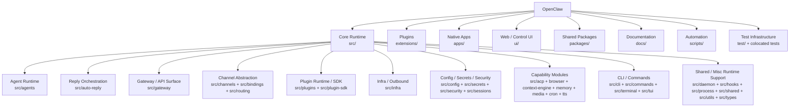
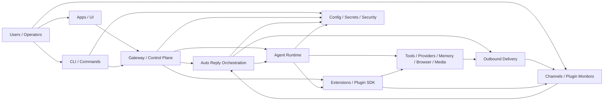
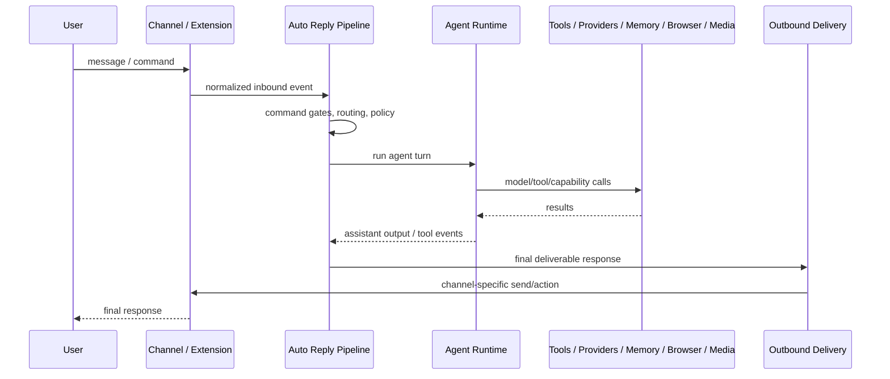
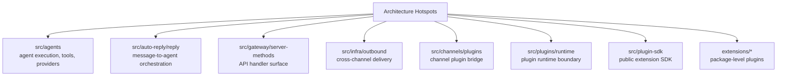

# OpenClaw Architecture Blueprint

Coverage: `partial`
Freshness: 2026-05-08
Mode: read-only architecture description, no source-code migration required

本文档把当前 OpenClaw 仓库整理成一套可维护的架构表达。目标不是改动代码目录，而是在现有代码之上建立一套稳定的“认知架构”：大模块、子模块、最小模块、依赖方向、运行流程、热区和验证入口。

## 0. 架构总览图

先看图，再看后面的模块说明。OpenClaw 的合理架构不是单纯树状，而是“顶层 ownership 树 + 运行时依赖 DAG”。

### 0.1 顶层 ownership 树



ASCII 版：

```text
OpenClaw
├─ src/          Core Runtime
│  ├─ Agent Runtime
│  │  └─ agents/
│  ├─ Reply Orchestration
│  │  └─ auto-reply/
│  ├─ Gateway / API Surface
│  │  └─ gateway/
│  ├─ Channel Abstraction
│  │  ├─ channels/
│  │  ├─ bindings/
│  │  └─ routing/
│  ├─ Plugin Runtime / Plugin SDK
│  │  ├─ plugins/
│  │  └─ plugin-sdk/
│  ├─ Infra / Outbound Delivery
│  │  └─ infra/
│  ├─ Config / Secrets / Security
│  │  ├─ config/
│  │  ├─ secrets/
│  │  ├─ security/
│  │  └─ sessions/
│  ├─ Capability Modules
│  │  ├─ acp/
│  │  ├─ browser/
│  │  ├─ context-engine/
│  │  ├─ cron/
│  │  ├─ media/
│  │  ├─ media-understanding/
│  │  ├─ memory/
│  │  └─ tts/
│  ├─ CLI / Commands
│  │  ├─ cli/
│  │  ├─ commands/
│  │  ├─ terminal/
│  │  └─ tui/
│  └─ Shared / Misc Runtime Support
│     ├─ daemon/
│     ├─ hooks/
│     ├─ process/
│     └─ shared/ utils/ types/
├─ extensions/  Plugin packages
├─ apps/        Native apps
├─ ui/          Web/control UI
├─ packages/    Shared packages
├─ docs/        Documentation
├─ scripts/     Automation
└─ test/        Cross-cutting test infra
```

### 0.2 运行时依赖 DAG



解读：

- `src/` 是系统内核，但内部不是单向树，而是多条运行链路交叉的 DAG。
- `extensions/*` 是插件包边界，生产代码应通过 `openclaw/plugin-sdk/*` 接入核心。
- `gateway`、`auto-reply`、`agents`、`infra/outbound` 是主要跨模块运行路径。
- Apps/UI/CLI 是控制面入口；channels/extensions 是消息面入口。

### 0.3 核心消息流



### 0.4 高风险热区图



这些热区不是“必须迁移”的目录，而是优先补充 leaf-module 文档、验证入口和 impact 检查规则的地方。

## 1. 总体判断

OpenClaw 当前最适合被理解为：

```text
插件化、多通道、跨平台的 agent runtime 系统。
```

它不是严格的树状单体，而是一个分层 DAG：

```text
Apps / UI / CLI / Channels
-> Gateway / Control Plane
-> Auto Reply Orchestration
-> Agent Runtime
-> Tools / Providers / Memory / Browser / Media
-> Outbound Delivery
-> Channel / Plugin Response
```

因此，完善架构不应只写成：

```text
大模块 -> 子模块 -> 最小模块
```

而应组合四个视图：

```text
Ownership Tree + Dependency DAG + Runtime Flow + Hotspot Map
```

这四个视图合在一起，才是当前仓库较完整、可用于维护和评审的架构。

## 2. 证据来源

本蓝图基于以下只读证据：

- 当前仓库目录结构。
- GitNexus `openclaw` 索引。
- GitNexus 统计：约 `134490` symbols、`185920` relationships、`2607` communities、`300` execution flows。
- GitNexus process 摘要：`292` cross-community flows，`8` intra-community flows。
- 现有 `.planning/impact-map/` 影响图谱。
- 现有插件边界、测试、构建、文档规则。

关键解释：`292/300` 的流程跨 community，说明 OpenClaw 的真实运行路径天然跨模块，不能用单一树状结构完整表达。

## 3. 顶层大模块

```text
OpenClaw
├─ Core Runtime: src/
├─ Plugins: extensions/
├─ Apps: apps/
├─ Web UI: ui/
├─ Shared Packages: packages/
├─ Documentation: docs/
├─ Automation: scripts/
└─ Test Infrastructure: test/ and colocated *.test.ts
```

| 大模块              | 路径                      | 主要职责                                                                     | 架构角色          |
| ------------------- | ------------------------- | ---------------------------------------------------------------------------- | ----------------- |
| Core Runtime        | `src/`                    | CLI、gateway、agent runtime、channels、plugins、config、infra、media、memory | 系统内核          |
| Plugins             | `extensions/`             | channel/provider/tool/media/memory/auth 插件                                 | 扩展生态          |
| Apps                | `apps/`                   | macOS、iOS、Android 客户端                                                   | 原生用户界面      |
| Web UI              | `ui/`                     | Web/control UI                                                               | 浏览器用户界面    |
| Shared Packages     | `packages/`               | 小型共享包                                                                   | 复用支撑          |
| Documentation       | `docs/`                   | Mintlify 文档和参考资料                                                      | 用户/维护者知识面 |
| Automation          | `scripts/`                | 构建、测试、发布、文档自动化                                                 | 工程自动化        |
| Test Infrastructure | `test/` + colocated tests | fixtures、helpers、集成测试                                                  | 验证体系          |

## 4. Core Runtime 子模块

下面这棵树按 logical Core Runtime 模块对物理 `src/` 目录分组；它是只读 ownership view，不要求移动源码。

```text
src/
├─ Agent Runtime
│  └─ agents/              # agent 执行、providers、tools、sandbox、Pi runner、auth profiles
├─ Reply Orchestration
│  └─ auto-reply/          # 消息到 agent 的 orchestration pipeline
├─ Gateway / API Surface
│  └─ gateway/             # gateway server、protocol、server methods、client-facing runtime
├─ Channel Abstraction
│  ├─ channels/            # channel abstraction、binding helpers、plugin channel support
│  ├─ bindings/            # binding provider records and compiled channel bindings
│  └─ routing/             # recipient/account/session route resolution
├─ Plugin Runtime / Plugin SDK
│  ├─ plugins/             # plugin runtime、contracts、loading、boundary enforcement
│  └─ plugin-sdk/          # extension-facing public SDK surface
├─ Infra / Outbound Delivery
│  └─ infra/               # outbound、network、TLS、common infrastructure
├─ Config / Secrets / Security
│  ├─ config/              # config IO、schema、validation、sessions、legacy migration
│  ├─ secrets/             # credential/secret resolution
│  ├─ security/            # audit、filesystem/path guards、security helpers
│  └─ sessions/            # session path and runtime state helpers
├─ Capability Modules
│  ├─ acp/                 # ACP client/server/control-plane/runtime
│  ├─ browser/             # browser bridge、routes、snapshot、debug、storage、actions
│  ├─ context-engine/      # context assembly、registry、types、legacy support
│  ├─ cron/                # scheduled/isolated agent jobs
│  ├─ media/               # media server/pipeline
│  ├─ media-understanding/ # media understanding capability
│  ├─ memory/              # memory/session files/vector/LanceDB bridge
│  └─ tts/                 # text-to-speech support
├─ CLI / Commands
│  ├─ cli/                 # CLI 注册和命令 wiring
│  ├─ commands/            # CLI command implementation
│  ├─ terminal/            # terminal output、palette、table/wrap helpers
│  └─ tui/                 # terminal UI
└─ Shared / Misc Runtime Support
   ├─ daemon/              # daemon/launch/runtime helpers
   ├─ hooks/               # hooks discovery/workspace integration
   ├─ process/             # process/supervisor helpers
   ├─ shared/              # shared primitives
   ├─ utils/               # utility helpers
   └─ types/               # shared types and compatibility helpers
```

### 4.1 Agent Runtime

| 子模块                | 路径                                                           | 职责                                                             | 最小模块候选                                             |
| --------------------- | -------------------------------------------------------------- | ---------------------------------------------------------------- | -------------------------------------------------------- |
| Agent execution core  | `src/agents/*.ts`                                              | agent command、scope、spawn、provider wiring、tool orchestration | 单个 runner/tool/provider 文件组 + colocated tests       |
| Agent tools           | `src/agents/tools/` and `src/agents/*tools*`                   | bash、apply-patch、browser/tool adapters、tool schema            | 每类 tool 一组                                           |
| Sandbox               | `src/agents/sandbox/`                                          | sandbox execution and isolation                                  | sandbox runner + tests                                   |
| Auth profiles         | `src/agents/auth-profiles/`                                    | provider auth profile selection and resolution                   | profile resolver + fixtures/tests                        |
| Pi embedded runner    | `src/agents/pi-embedded-runner/`                               | Pi/local embedded agent runtime                                  | runner、compaction、extensions、provider-specific slices |
| Pi helpers/extensions | `src/agents/pi-embedded-helpers/`, `src/agents/pi-extensions/` | Pi runner support and context pruning                            | helper group + tests                                     |
| Skills                | `src/agents/skills/`                                           | skill discovery, refresh, plugin skills                          | skill loader/refresh group                               |
| Schema                | `src/agents/schema/`                                           | tool schema/typebox helpers                                      | schema contract group                                    |

架构判断：`src/agents/` 是最大热区之一。现阶段不迁移源码，但在架构认知上应拆成 execution、tools、providers/auth、sandbox、Pi、skills、schema 几个逻辑叶子。

### 4.2 Reply Orchestration

| 子模块             | 路径                                                                      | 职责                                                       | 最小模块候选                         |
| ------------------ | ------------------------------------------------------------------------- | ---------------------------------------------------------- | ------------------------------------ |
| Reply pipeline     | `src/auto-reply/`                                                         | message processing and reply orchestration                 | top-level command/auth/chunk modules |
| Agent runner       | `src/auto-reply/reply/agent-runner*`                                      | run agent, payload, memory, execution lifecycle            | runner file group                    |
| Commands           | `src/auto-reply/reply/commands-*`, `commands-acp/`, `commands-subagents/` | command detection, gates, approvals, ACP/subagent commands | command family                       |
| Streaming/blocking | `src/auto-reply/reply/block-*`, `abort-*`                                 | stream/block behavior, abort handling                      | streaming/abort group                |
| Exec               | `src/auto-reply/reply/exec/`                                              | command execution support                                  | exec group                           |
| Queue              | `src/auto-reply/reply/queue/`                                             | reply queueing                                             | queue group                          |
| Export HTML        | `src/auto-reply/reply/export-html/`                                       | transcript/export support                                  | export group                         |
| Channel shaping    | `src/auto-reply/reply/channel-*`, delivery-related helpers                | channel-specific reply context/shaping                     | channel shaping group                |

架构判断：`src/auto-reply/reply/` 是消息进入 agent 的核心热区。它应该被文档化为 runner、commands、streaming、exec、queue、export、channel shaping，而不是只看作一个目录。

### 4.3 Gateway / API Surface

| 子模块                | 路径                                                        | 职责                                                                                  | 最小模块候选                       |
| --------------------- | ----------------------------------------------------------- | ------------------------------------------------------------------------------------- | ---------------------------------- |
| Gateway server        | `src/gateway/server/`, `src/gateway/*.ts`                   | gateway lifecycle, auth, server startup, connection handling                          | server lifecycle group             |
| Protocol              | `src/gateway/protocol/`                                     | protocol contracts                                                                    | protocol group                     |
| Server methods        | `src/gateway/server-methods/`                               | API method handlers for agents, chat, config, nodes, browser, devices, skills, system | one domain/handler family per leaf |
| Gateway client/call   | `src/gateway/client.ts`, `src/gateway/call.ts`              | client-side gateway interaction                                                       | client/call group                  |
| Gateway tests/helpers | `src/gateway/*test*`, `test/helpers/gateway-e2e-harness.ts` | gateway validation support                                                            | test helper group                  |

架构判断：`src/gateway/server-methods/` 是 API surface 热区。改变 API handler 前应做 GitNexus API impact / route impact 分析。

### 4.4 Channel Abstraction

| 子模块                    | 路径                                           | 职责                                                            | 最小模块候选                                     |
| ------------------------- | ---------------------------------------------- | --------------------------------------------------------------- | ------------------------------------------------ |
| Core channel abstractions | `src/channels/*.ts`                            | ack/status/logging/transport/common channel behavior            | small file groups                                |
| Plugin channel bridge     | `src/channels/plugins/`                        | binding, catalog, configured bindings, plugin channel contracts | binding/actions/contracts/outbound/status leaves |
| Allowlists                | `src/channels/allowlists/`                     | allowlist matching                                              | allowlist group                                  |
| Transport/web             | `src/channels/transport/`, `src/channels/web/` | transport and web channel helpers                               | transport group                                  |

架构判断：`src/channels/plugins/` 是 core channel abstraction 和 extension channel plugin 的桥。它应作为独立架构边界维护。

### 4.5 Plugin Runtime / Plugin SDK

| 子模块              | 路径                        | 职责                                                                     | 最小模块候选                       |
| ------------------- | --------------------------- | ------------------------------------------------------------------------ | ---------------------------------- |
| Plugin SDK          | `src/plugin-sdk/`           | public SDK subpaths consumed by extensions                               | one public subpath per API surface |
| Plugin runtime      | `src/plugins/runtime/`      | plugin loading, runtime adapters, channel/provider/tool/runtime services | runtime adapter groups             |
| Plugin contracts    | `src/plugins/contracts/`    | plugin metadata/contracts                                                | contract group                     |
| Plugin test helpers | `src/plugins/test-helpers/` | testing support                                                          | helper group                       |

架构判断：这是 published/internal boundary 风险最高的区域之一。改 public SDK surface 需要 drift/API checks。

### 4.6 Infra / Outbound Delivery

| 子模块            | 路径                     | 职责                                                                      | 最小模块候选                                        |
| ----------------- | ------------------------ | ------------------------------------------------------------------------- | --------------------------------------------------- |
| Outbound delivery | `src/infra/outbound/`    | delivery queue, routing, channel selection, send service, message actions | delivery/routing/actions/identity/formatting leaves |
| Network           | `src/infra/net/`         | network helpers                                                           | net group                                           |
| TLS               | `src/infra/tls/`         | TLS helpers                                                               | tls group                                           |
| Time formatting   | `src/infra/format-time/` | time formatting                                                           | format-time group                                   |

架构判断：`src/infra/outbound/` 是跨渠道发送引擎，应作为高优先级 logical leaf map 维护。

### 4.7 Config / Secrets / Security

| 子模块      | 路径                   | 职责                                                                                                                                                           |
| ----------- | ---------------------- | -------------------------------------------------------------------------------------------------------------------------------------------------------------- |
| Config core | `src/config/`          | config IO, validation, schema, includes, legacy migration                                                                                                      |
| Sessions    | `src/config/sessions/` | session config and target resolution                                                                                                                           |
| Secrets     | `src/secrets/`         | credential storage/resolution/runtime secrets; impact-map splits ref contracts, target registry, runtime collection, gateway/CLI resolution, and storage/audit |
| Security    | `src/security/`        | audit, path guard, temp path guard, scan/fix support                                                                                                           |

架构判断：这些模块应尽量保持下层依赖，不应反向依赖 gateway/agents/auto-reply 的业务细节。

### 4.8 Capability Modules

| 子模块              | 路径                       | 职责                                                                                                                                                                    |
| ------------------- | -------------------------- | ----------------------------------------------------------------------------------------------------------------------------------------------------------------------- |
| Browser             | `src/browser/`             | browser bridge, Playwright/CDP sessions, action/snapshot/debug routes                                                                                                   |
| Memory              | `src/memory/`              | memory managers, session files, vector/LanceDB bridge                                                                                                                   |
| Media               | `src/media/`               | media server and media handling                                                                                                                                         |
| Media understanding | `src/media-understanding/` | media understanding capability contracts/runtime                                                                                                                        |
| Context engine      | `src/context-engine/`      | context assembly and registry                                                                                                                                           |
| TTS                 | `src/tts/`                 | text-to-speech support                                                                                                                                                  |
| Cron                | `src/cron/`                | scheduled and isolated jobs                                                                                                                                             |
| ACP                 | `src/acp/`                 | ACP client/server/control-plane integration; impact-map splits control-plane, runtime/session identity, translator/protocol, persistent bindings, and secret/env bridge |

## 5. Plugins 架构

插件位于 `extensions/*`。它们是 workspace packages，不应被当成 `src/` 内部目录。

### 5.1 插件类型

```text
extensions/
├─ channel plugins       # Discord, Telegram, Slack, Matrix, WhatsApp, etc.
├─ provider plugins      # OpenAI, Anthropic, XAI, Google, Minimax, etc.
├─ tool/capability       # Tavily, Firecrawl, Exa, Brave, DuckDuckGo, etc.
├─ memory/media/voice    # memory-core, memory-lancedb, voice-call, deepgram, elevenlabs
└─ auth/integrations     # qwen-portal-auth, github-copilot, cloudflare gateway, etc.
```

### 5.2 插件边界

允许方向：

```text
extensions/<id>/production code
  -> openclaw/plugin-sdk/*
  -> local files in extensions/<id>/
  -> external npm dependencies declared by that extension
```

禁止方向：

```text
extensions/<id>/production code -> src/** direct relative import
extensions/<id>/production code -> another extension's src/**
extensions/<id>/dependencies -> workspace:* runtime deps
```

架构判断：插件边界是当前仓库最清晰的大边界之一。完善架构时，应维持“每个 extension 是一个 leaf module”的原则。

## 6. Apps / UI 架构

```text
apps/
├─ macos/       # macOS menubar app, local gateway control, platform integration
├─ ios/         # iOS app, tests, watch/share/widget surfaces where present
├─ android/     # Android app and Gradle project
└─ shared/      # shared app code

ui/
└─ src/         # web/control UI
```

Apps/UI 的架构角色是 client/control surface。它们应通过 gateway/public APIs/config surfaces 观察和控制系统，不应拥有 core runtime 内部逻辑。

## 7. 依赖方向

当前推荐的 dependency DAG：

```text
Apps / UI
  -> Gateway client / public API

CLI / Commands
  -> Config
  -> Gateway client/runtime
  -> Agent public entrypoints
  -> Plugin runtime

Gateway
  -> Auto Reply
  -> Agents
  -> Channels
  -> Config
  -> Infra
  -> Plugins

Auto Reply
  -> Agents
  -> Channels
  -> Infra / Outbound
  -> Config
  -> ACP

Agents
  -> Config
  -> Infra
  -> Plugins
  -> Plugin SDK contracts
  -> Security
  -> Memory / Browser / Media capabilities

Channels
  -> Plugin channel contracts
  -> Infra outbound
  -> Config

Extensions
  -> openclaw/plugin-sdk/*
  -> local extension files only

Plugin SDK
  -> stable core contracts
```

高风险或禁止方向：

```text
extensions/* -> src/**                  # except public plugin SDK subpaths
src/plugin-sdk -> extensions/*
src/infra -> src/gateway
src/config -> src/gateway / src/agents / src/auto-reply
apps/* -> src/internal runtime files
ui/* -> src/internal runtime files
```

测试文件可以有少量 fixture/helper 穿透，但 production code 应按上述规则约束。

## 8. 核心运行流程

### 8.1 用户消息到 agent 回复

```text
Channel / Plugin monitor
-> channel binding and message normalization
-> auto-reply pipeline
-> command detection and gates
-> agent runner
-> model provider / tools / memory / browser / media
-> outbound delivery
-> channel response
```

主要路径：

```text
extensions/*
src/channels/
src/channels/plugins/
src/auto-reply/reply/
src/agents/
src/plugins/runtime/
src/infra/outbound/
```

### 8.2 Gateway 控制流

```text
CLI / App / Web UI
-> gateway HTTP/API method
-> server-methods handler
-> config / sessions / agents / channels / plugins
-> response or event stream
```

主要路径：

```text
src/cli/
src/commands/
src/gateway/
src/gateway/server-methods/
apps/
ui/
```

### 8.3 Plugin 注册和执行

```text
extension package
-> openclaw.plugin.json metadata
-> openclaw/plugin-sdk/* contract
-> plugin runtime loader
-> channel/provider/tool registration
-> core runtime execution path
```

主要路径：

```text
extensions/*
src/plugin-sdk/
src/plugins/runtime/
src/channels/plugins/
```

### 8.4 Browser capability

```text
agent/browser tool request
-> browser route
-> browser profile/session resolution
-> Playwright/CDP bridge
-> snapshot/storage/debug/action route behavior
```

主要路径：

```text
src/browser/
src/browser/routes/
src/agents/tools/
src/gateway/server-methods/browser.ts
```

### 8.5 Outbound delivery

```text
agent/reply output
-> outbound policy and channel selection
-> delivery queue / send service
-> channel adapter / plugin action
-> external messaging surface
```

主要路径：

```text
src/infra/outbound/
src/channels/plugins/outbound/
extensions/*/src/send*
```

## 9. 最小模块规则

最小模块不是单个文件，而是最小的可维护/可验证单元。

一个合格 leaf module 应满足：

- 职责明确。
- 有稳定入口或清晰文件组。
- 有 colocated test 或明确上层测试覆盖。
- 有第一验证命令。
- 有明确 upstream/downstream 依赖。
- 改动时能判断 blast radius。

示例：

```text
src/infra/outbound/delivery-queue.ts
src/infra/outbound/delivery-queue.test.ts

src/browser/routes/tabs.ts
src/browser/routes/tabs.test.ts

src/gateway/server-methods/chat.ts
src/gateway/server-methods/chat.*.test.ts

extensions/discord/src/*
extensions/discord/openclaw.plugin.json
```

不要因为目录大就机械拆 leaf。只有当子路径具有独立职责、独立验证策略或不同风险面时，才定义新的 leaf。

## 10. 热区地图

| 热区                          | 原因                                                                           | 建议架构处理                                                                 |
| ----------------------------- | ------------------------------------------------------------------------------ | ---------------------------------------------------------------------------- |
| `src/agents/`                 | 最大核心复杂区之一，包含 execution、tools、providers、auth、sandbox、Pi runner | 文档上拆成多个 logical leaves                                                |
| `src/auto-reply/reply/`       | 消息到 agent 的核心 orchestration path                                         | 文档上拆成 runner、commands、streaming、exec、queue、export、channel shaping |
| `src/gateway/server-methods/` | API surface，影响 CLI/App/UI/gateway clients                                   | 每个 handler domain 作为 API leaf，改动前做 API impact                       |
| `src/infra/outbound/`         | 跨渠道发送和 action pipeline                                                   | 文档上拆 delivery、routing、actions、identity、formatting                    |
| `src/channels/plugins/`       | core channel 和 extension channel 的桥                                         | 作为 channel plugin boundary 维护                                            |
| `src/plugins/runtime/`        | plugin loading/runtime contracts                                               | 作为 plugin runtime boundary 维护                                            |
| `src/plugin-sdk/`             | extension-facing public surface                                                | 作为 published/API drift 风险面维护                                          |
| `extensions/*`                | 插件生态，数量多，运行依赖独立                                                 | 每个 extension 是 package-level leaf                                         |
| `apps/*`, `ui/`               | 用户可见控制面                                                                 | provider/channel/status list 必须与 core 能力同步                            |

## 11. 架构质量评估

当前评分：`7/10`。

健康点：

- 顶层物理边界清晰。
- 插件大多通过 SDK 接入。
- Apps/UI 与 core runtime 物理隔离。
- 测试大量 colocated，便于定位最小验证范围。
- 已有 lint/test scripts 在维护 plugin/core 边界。

不足点：

- `src/agents/` 和 `src/auto-reply/reply/` 顶层认知负担较高。
- `src/gateway/server-methods/` API surface 风险较高，需要更强文档化。
- GitNexus community labels 不够稳定，不能直接作为模块树。
- 真实运行流是 cross-community DAG，纯树状视图会隐藏耦合。

## 12. 不改源码的优化路径

只通过 `.planning`、图谱和检查来优化架构认知：

1. 保持本蓝图作为完整架构入口。
2. 保持 `.planning/architecture/ARCHITECTURE-ATLAS.md` 作为图谱/证据型 Atlas。
3. 保持 `.planning/impact-map/MODULE-INDEX.md` 作为 ownership index。
4. 为热区补 leaf index 和 change-to-test：
   - `src/agents/`
   - `src/auto-reply/reply/`
   - `src/gateway/server-methods/`
   - `src/infra/outbound/`
   - `src/channels/plugins/`
   - `src/plugins/runtime/`
   - `src/plugin-sdk/`
5. 对每个 leaf 记录：
   - 职责。
   - 入口文件。
   - 上游/下游。
   - 第一验证命令。
   - GitNexus impact/query 建议。
6. 用现有 lint/test/build/drift checks 固化边界。

## 13. 维护检查清单

未来任何改动前，先问：

- 改动路径属于哪个大模块？
- 属于哪个 logical leaf？
- 是否触碰 hotspot？
- 是否改变 public SDK/config/API/build/package surface？
- 是否违反 dependency DAG？
- extension 是否只依赖 `openclaw/plugin-sdk/*` 和本地文件？
- 是否有 targeted test？
- 是否需要 GitNexus impact 或 API impact？
- 是否需要 `pnpm build`、SDK drift check、config docs check？

## 14. 推荐架构入口文件

```text
.planning/architecture/OPENCLAW-ARCHITECTURE-BLUEPRINT.md  # 本文：完整架构蓝图
.planning/architecture/ARCHITECTURE-ATLAS.md              # 证据/视图型 Atlas
.planning/impact-map/MODULE-INDEX.md                    # 大模块 ownership index
.planning/impact-map/LEAF-MODULE-TAXONOMY.md            # leaf module 定义规则
.planning/impact-map/src/leaf-index.md                  # Core Runtime logical module index
.planning/impact-map/extensions/*/leaf-index.md         # plugin leaf indexes
```
